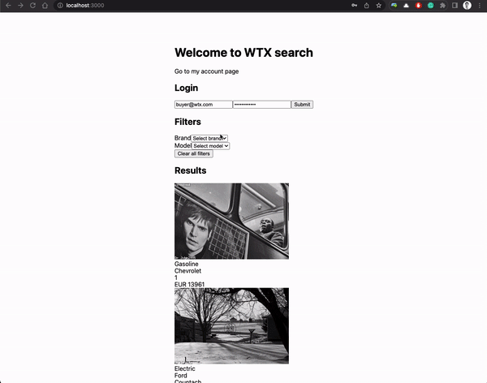

# WTX - frontend challenge

WTX is providing truck buyers the best way to find trucks for their needs. To achieve that, as any other marketplace, there's a truck listing page where buyers can search for the trucks they want. This is a typical listing page with filters and pagination.

This page is responsible for showing multiple trucks to buyers. As any other search page, the users can filter, sort, and change pages.

At the time this was implemented, the team was on a rush. 

It's a fact that the search **seems to be working**, but the feedback we got from developers is that it's getting hard to implement new features. This is affecting the reliability as well as the speed of development.

## What does the application do?

- When the user changes the `brand` filter, the `model` options are refetched.
- When the uses changes pages, the page is refetched with the new page
- When the uses clears all filter, page is refetched with default parameters

## Known issues

Also, our users say that sometimes they see some strange behaviors when they change filters. They report that they see some flashes, or that sometimes random results appear. Also, the loading state is quite inconsistent.

## What are the missing features?

- Login is not working. We know the backend endpoint returns a token whenever we authenticate with `buyer@wtx.com` with the `Password123+` password but somehow the UI seems not to be working

- My account page is an authenticated page, as we couldn't get the login to work, we can't fetch the data from the `/api/user` route (which requires the `token`)

- The UI is still far from what we want, our designer made available a few mockups which are available [at the mockups folder](./mockups/vehicle-listing-filter.png). You can also directly access the [figma file](https://www.figma.com/file/Rx4tUDbfx61jcbxOjsC7iS/wtx-figma).

You **don't** need to fully implement these features/fix these bugs if you don't want to. We mostly want to understand your approach and what you would do to fix/implement this.

# The challenge

After you have a look around the code, we want to hear from you in what ways would you improve this. Feel free to ask questions about how it works.

1. What steps would you take to make this code better?
2. Have you found any "red-flags"?
3. If you were pairing with a junior dev, what would be your initial steps to start fixing this?
4. What do you see as the major issues on this code?
5. Do you identify any bugs by looking at the code (and seeing it working)?
6. What would you do to debug these problems with flashes while searching?kjjkjjj

**Note:** you can (obviously have a look at the api routes `pages/api/`) but you're not supposed to fix/redesign anything there. It's just there to enable the frontend to work.

# Possible challenges

1. If the filters selected are "brand=mercedes" and "model=actros" we want to send to the backend the query parameter "promotion=true". How would you proceed?

2. How would you fix the login bug currently happening?

3. Assuming that the authentication bug is fixed (and that we get a token on the `/api/auth` request), how would you handle the authentication state to guarantee that the my-account page works?

4. Have you checked the loading state? What would be your approach to improve it? 

5. If you had to make this page faster, what would you do?

6. Imagine you had a loader implemented on the search page, but now you want to use it in multiple other pages, what would you do?

7. Any tools/approaches you would use to make this code better?

8. What do you think in missing in order to make this code reach production?
